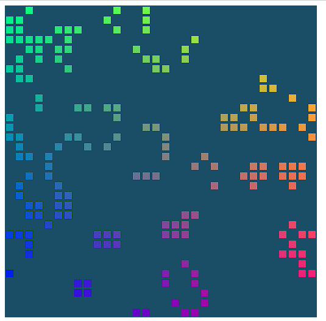

# Web GPU Google CodeLab

In this codelab, you build Conway's Game of Life using WebGPU. Your app will:

- Use WebGPU's rendering capabilities to draw simple 2D graphics
- Use WebGPU's compute capabilities to perform the simulation

Unlike [original CodeLab](https://codelabs.developers.google.com/your-first-webgpu-app#0) this implementation uses
TypeScript and Vite for development.

Another improvement over original one is also the separation of the .wgsl shader source code to files and their loading
with Vite raw import.

## Result

## Deploy

The easiest way to test the actual result is:

- Download the source code
- Run `npm install`
- Run `npm run dev`
- Check out the `http://localhost:5173/` local address
